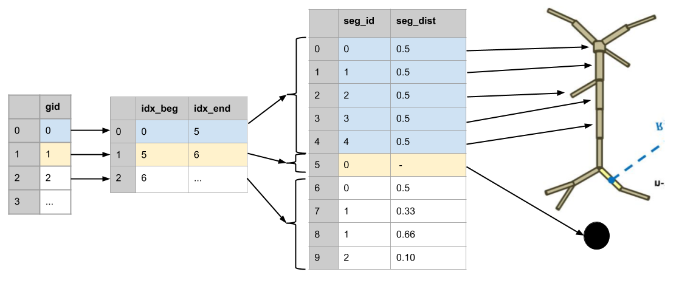
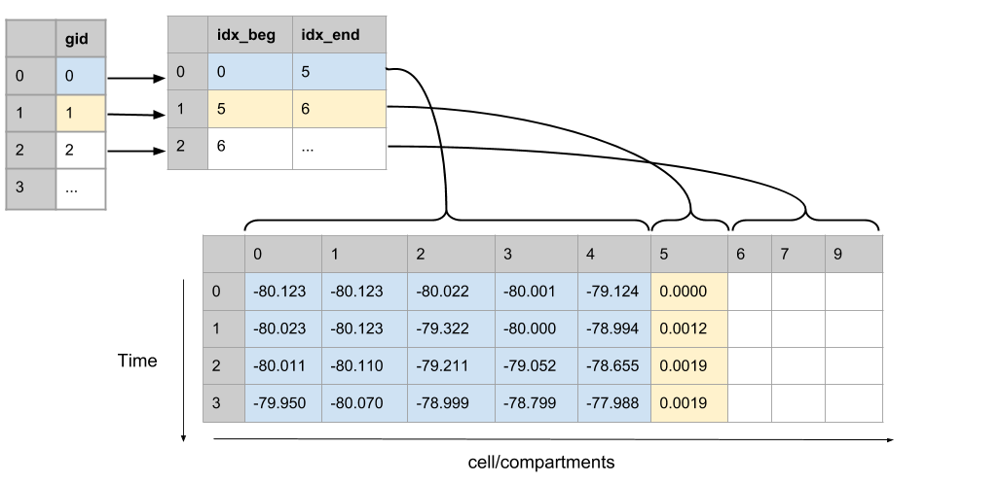
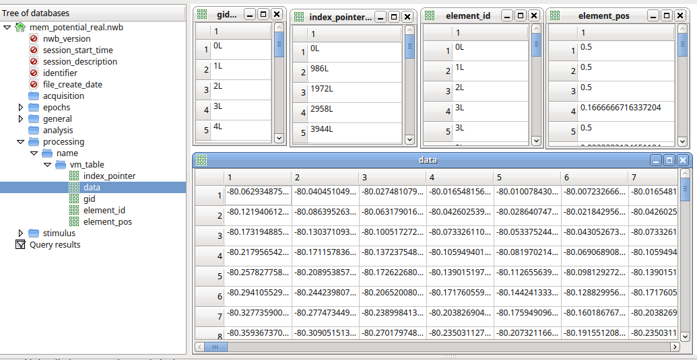

Back to [Projects List](../../README.md#ProjectsList)

# Storage of large-scale network simulation output

## Key Investigators

- Kael Dai (Allen Institute) @kaeldai
- Ben Dichter (Stanford Lab) @bendichter
- Yazan Billeh (Allen Institute) @CellAssembly

# Project Description

An efficent, parallizable way to store the results, and even the input, of large-scale in-silico network simulations.

## Objective

1. Create an extension for storing and reading discrete single unit simulation data (ie spike times from a biophysical/point network simulation).
2. Create an extension for continuous data (ie membrane potential, calcium conc). 
   * May have to create a second extension for multi-compartment reporting (ie membrane potential along all sections of the dentrites)

## Approach and Plan

### Multicell, multicompartment continuous data storage
Goals:
* Need to store cell variable data (membrane potential, [Ca++], etc), collected during a simulation
* Need to be able to store data across data for multiple cells
* Individual cells may be made up of different sections (soma, axon, dendritic branches) potentially needing to be stored.
 * Want to be able to write/read in parallel.
 * Want to be able to chunk data by time or by cell

Conceptural Framework:
* Use an index table to store a range of segment ids. Using the index of the two tables, one can find the various segments of each cell being stored in data.
* Also allow for storage of relative recording position along the given segment.

* The index is used by the datatable to cluster multiple segments into the same cell. 
  * Orient by column to get simulation information about any given cell
  * Orient by row to to get all cells/segments at 

## Progress and Next Steps

<!--Describe progress and next steps in a few bullet points as you are making progress.-->

# Illustrations

<!--Add pictures and links to videos that demonstrate what has been accomplished.-->

<!---->

<!---->

# Background and References

<!--Use this space for information that may help people better understand your project, like links to papers, source code, or data.-->

- Forum: https://github.com/orgs/NeurodataWithoutBorders/teams/networkoutput
- Source code: https://github.com/NeurodataWithoutBorders/nwb_hackathons/tree/master/HCK04_2018_Seattle/Projects/NetworkOutput
