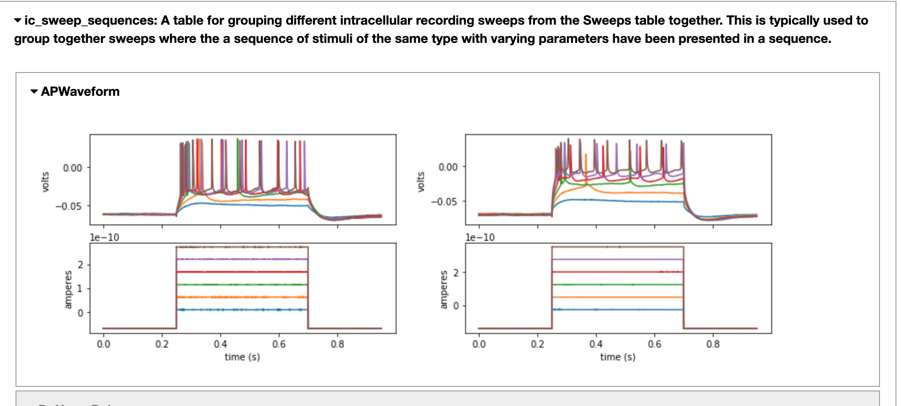

[:rewind: Back to the projects list](../../README.md#ProjectsList)

<!-- For information on how to write GitHub .md files see https://guides.github.com/features/mastering-markdown/ -->

# Visualization of hierarchical icephys experiments

## Key Investigators

- Ben Dichter (Ben Dichter Consulting LLC)
- Liviu Soltuzu (Laboratory of Neural Microcircuitry & Blue Brain Project, EPFL)

## Project Description

The jupyter widget will combine and plot traces at the same level of the hierarchy. 

For example, for a given Stimulus Type and Electrode, under the `ic_sweep_sequences`
table, plot all stimulation and response traces.

## Objectives

<!-- Briefly describe the objectives of your project. What would you like to achive?-->

<!-- 1. Objective A. Describe it in 1-2 sentences.-->
<!-- 1. Objective B. Describe it in 1-2 sentences.-->
<!-- 1. ...-->

## Approach and Plan

<!-- 1. Describe the steps of your planned approach to reach the objectives.-->
<!-- 1. ... -->
<!-- 1. ... -->

## Progress and Next Steps

<!--Populate this section as you are making progress before/during/after the hackathon-->
<!--Describe the progress you have made on the project,e.g., which objectives you have achieved and how.-->
<!--Describe the next steps you are planing to take to complete the project.-->

## Materials

<!--If available add links to the materials relevant to the project, e.g., the code generated for the project or data used-->
<!--If available add pictures and links to videos that demonstrate what has been accomplished.-->
<!---->

## Background and References

<!--Use this space for information that may help people better understand your project, like links to papers, source code, or data ,e.g:-->
<!-- - Source code: https://github.com/YourUser/YourRepository -->
<!-- - Documentation: https://link.to.docs -->
<!-- - Test data: https://link.to.test.data -->

